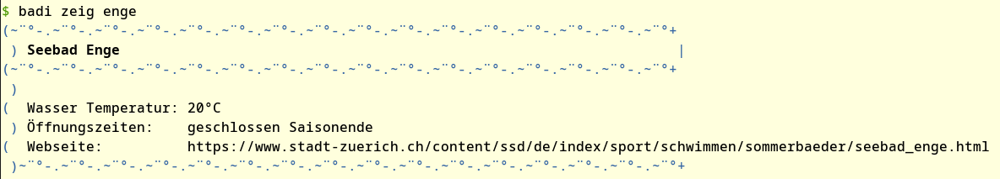

# Zürich Baths
Client to query open data about public open-air baths in Zürich.

## Usage
```go
import baths "github.com/coffeemakr/zuerich-baths"

baths, err := baths.GetBaths()
if err != nil {
    fmt.Printf("Fehler: Konnte nicht geladen werden.\nMehr Infos: %s", err)
    os.Exit(1)
}

for _, bath := range baths {
    fmt.Printf("%-30s: %2.1f°C\n", bath.Name, bath.WaterTemperature)
}
```


## Client
There is a CLI just for fun.



## Weblinks
* https://data.stadt-zuerich.ch/dataset/wassertemperaturen-freibaeder
* https://opendata.swiss/de/dataset/wassertemperaturen-freibader
* API endpoint: https://www.stadt-zuerich.ch/stzh/bathdatadownload